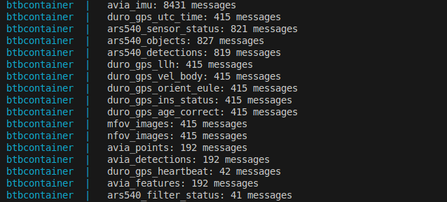

# bin_to_ros2bag

## Setup
1. Place .bin file(s) into `bin_logs/`.
2. If needed, use [`combine_bin.py`](./combine_bin.py) to merge multiple .bin files into a single file.
3. Application is Dockerized. To build and run the converter:
   ```
   sudo docker compose up --build
   ```
4. To delete all converted outputs:
   ```bash
   sudo rm -rf ros2_bags_output/
   ```
5. Replay ROS 2 bags with our system's GLIM module: https://github.com/intramotev/perception-system/tree/livox-slam

## Demo
[▶️ Watch video](assets/sampletest.mp4)

## Notes
**Preface:** Data gathered from log_20250409_172141_190_0849.bin to log_20250409_172141_190_0855.bin (inclusive). Each file size is 1 GB, for a combined total of 7 GB.



### Problem 1: Low Point Cloud Count ( `perception-system/livox/openpylivox.py`)
Only `avia_points: 192` messages were extracted from a 7 GB segment of data, which suggests that very little usable LiDAR data was actually captured.

Frame publication depends on elapsed time and available Redis buffer space:
```python
if (timestamp_sec - last_frame_time) >= self.frame_time_s: 
    point_packet_proto.system_timestamp_us = int(time.time()*1e6)
    # ...
    if self.do_streaming_optimization:
        if max_current_client_memory < self.streaming_memory_threshold:
            r.publish(self.point_channel_name,point_packet_proto.SerializeToString())
        else:
            print(f"Client buffer near full ({max_current_client_memory}). Skipping points publish...") 
    else:
        r.publish(self.point_channel_name,point_packet_proto.SerializeToString())
```
Even though the `config.yaml` sets a frame rate target of about 5Hz, the extremely low number of point cloud messages points to significant frame dropping—likely due to Redis buffer pressure or system overload during recording.

### Problem 2: Low Effective Orientation Update Rate for IMU (~10Hz from Duro GPS)
There’s a large difference in the number of IMU vs. orientation messages:
```yaml
avia_imu: 8431 messages  
duro_gps_orient_eule: 415 messages
```

This implies that while IMU (gyro/accel) data is available at high frequency (~200Hz), orientation updates from the Duro GPS come in much more slowly—around 10Hz. This limits how often the system can refresh orientation in fused IMU messages.

### Problem 3: Hardware Time Sync Absent (`perception-system/livox/openpylivox.py`)
Both point and IMU timestamps are based on `time.time()` when messages are published:
```python
point_packet_proto.system_timestamp_us = int(time.time()*1e6)
imu_data_proto.system_timestamp_us = int(time.time()*1e6)
```

Duro messages do carry GPS time `(tow)`, but only within their own data structure:
```python
pb_msg = MsgOrientEuler() 
pb_msg.tow = msg.tow
redis_client.publish(config['publish_channel_orient_euler'], pb_msg.SerializeToString())
```

The final timestamp used in the logged data is still based on the system clock: (`perception-system/logger/run_logger.py`):
```python
timestamp = get_current_timestamp()
```

So while the system brings everything into a shared time domain (Unix time), there's no shared hardware clock like PPS to align Livox and Duro data precisely. This introduces small residual timing differences between sensor streams.

### Why This Matters
These issues—especially the lack of LiDAR data—have a direct impact on downstream applications like SLAM. For example, GLIM is a LiDAR-based SLAM system that depends on frequent and consistent point cloud data. With only 192 scans in such a large file, the system will struggle to build a dense, accurate map or maintain trajectory continuity. While minor IMU misalignment or timing discrepancies can sometimes be tolerated, not having enough point clouds is a hard blocker for most range-based localization and mapping workflows.